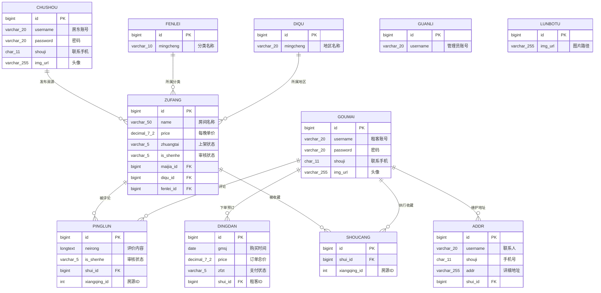

```mermaid
erDiagram
    DIQU ||--o{ ZUFANG : "所属地区"
    FENLEI ||--o{ ZUFANG : "所属分类"
    CHUSHOU ||--o{ ZUFANG : "发布房源"
    GOUMAI ||--o{ DINGDAN : "下单预订"
    GOUMAI ||--o{ PINGLUN : "发表评论"
    GOUMAI ||--o{ SHOUCANG : "执行收藏"
    GOUMAI ||--o{ ADDR : "维护地址"
    ZUFANG ||--o{ PINGLUN : "被评论"
    ZUFANG ||--o{ SHOUCANG : "被收藏"

    DIQU {
        bigint id PK
        varchar_20 mingcheng "地区名称"
    }

    FENLEI {
        bigint id PK
        varchar_10 mingcheng "分类名称"
    }

    CHUSHOU {
        bigint id PK
        varchar_20 username "房东账号"
        varchar_20 password "密码"
        char_11 shouji "联系手机"
        varchar_255 img_url "头像"
    }

    GOUMAI {
        bigint id PK
        varchar_20 username "租客账号"
        varchar_20 password "密码"
        char_11 shouji "联系手机"
        varchar_255 img_url "头像"
    }

    ZUFANG {
        bigint id PK
        varchar_50 name "房间名称"
        decimal_7_2 price "每晚单价"
        varchar_5 zhuangtai "上架状态"
        varchar_5 is_shenhe "审核状态"
        bigint maijia_id FK
        bigint diqu_id FK
        bigint fenlei_id FK
    }

    DINGDAN {
        bigint id PK
        date gmsj "购买时间"
        decimal_7_2 price "订单总价"
        varchar_5 zfzt "支付状态"
        bigint shui_id FK "租客ID"
    }

    PINGLUN {
        bigint id PK
        longtext neirong "评价内容"
        varchar_5 is_shenhe "审核状态"
        bigint shui_id FK
        int xiangqing_id "房源ID"
    }

    SHOUCANG {
        bigint id PK
        bigint shui_id FK
        int xiangqing_id "房源ID"
    }

    ADDR {
        bigint id PK
        varchar_20 username "联系人"
        char_11 shouji "手机号"
        varchar_255 addr "详细地址"
        bigint shui_id FK
    }

    GUANLI {
        bigint id PK
        varchar_20 username "管理员账号"
    }

    LUNBOTU {
        bigint id PK
        varchar_255 img_url "图片路径"
    }
```